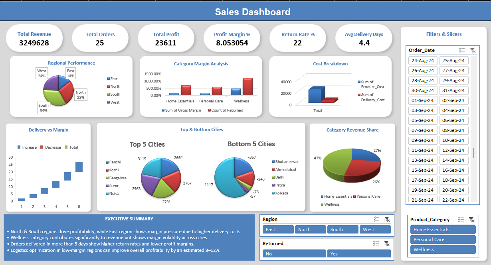

# business-performance-kpi-dashboard
Executive-style KPI dashboard analyzing business performance, profitability, and operational efficiency using Excel, with a roadmap for SQL and Power BI integration.

## Table of Contents
- [Overview](#overview)
- [Business Problem](#business-problem)
- [Dashboard Features](#dashboard-features)
- [Key Insights](#key-insights)
- [Tools Used](#tools-used)
- [Future Enhancements](#future-enhancements)
- [Repository Structure](#repository-structure)

---

## Overview
This project simulates a real-world Business Analyst assignment focused on analyzing operational performance, profitability, and delivery efficiency for a consumer business.

The objective was to convert raw order-level data into actionable business insights using structured KPI analysis and an executive-ready Excel dashboard.

---

## Business Problem
Despite consistent order volumes, the business observed uneven profitability across regions, cities, and product categories.

Management needed clarity on:
- Which regions and cities are driving or reducing profitability  
- How delivery performance impacts return rates and margins  
- Where operational inefficiencies are causing cost leakages  
- Which areas should be prioritized for performance improvement  

---

## Dashboard Features
The Excel dashboard provides:
- Total Revenue and Total Orders overview  
- Gross Profit and Profit Margin analysis  
- Return Rate and Average Delivery Days tracking  
- Regional performance comparison  
- Category-level margin analysis  
- Top and bottom performing cities  
- Interactive slicers for dynamic filtering  

The dashboard is designed for quick decision-making by business and operations teams.

---

## Key Insights
- Certain regions show margin pressure primarily due to higher delivery costs.  
- Orders delivered beyond defined timelines tend to have higher return rates.  
- A small group of cities contributes disproportionately to losses.  
- Operational optimization in low-performing regions can potentially improve overall margins by 8–12%.  

---

## Tools Used
- Microsoft Excel  
  - Pivot Tables  
  - Calculated Fields  
  - KPI Cards  
  - Interactive Slicers  
  - Dashboard Layout & Formatting  

---

## Future Enhancements
- SQL-based data extraction and aggregation  
- Power BI dashboard for scalable and interactive reporting  
- Automated refresh and deeper drill-down analysis  

---

## Repository Structure
